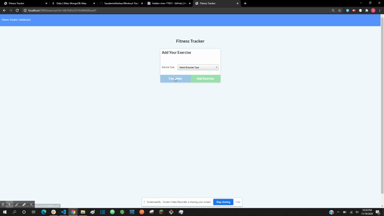

# Workout Tracker

## Description
This applicaiton allows users to log their workouts and track their progress as well as various stats. Users are also able to add multiple exercises to their workout plan as well start with a new workout plan if desired.

## Table of Contents
- [Installation](#Installation)
- [Usage](#Usage)
- [Questions](#Questions)

## Installation
This application is deployed using Heroku. If the user would like to download this and use it locally, run an 'npm install' in the terminal, prior to use. 

## Usage
Use this application to track workout and various exercise stats each week. This will allow users to view progress and see where they can improve. By clicking on the "New Workout" button, users can start adding exercises to a new workout plan. By clicking the "Continue Workout" button users can continue to add exercises to their current workout plan.

## Questions
GitHub Username: JAndrews16

Deployed Link: https://hidden-river-77651.herokuapp.com/?id=5fb1ffefb7542d00178b9cff

